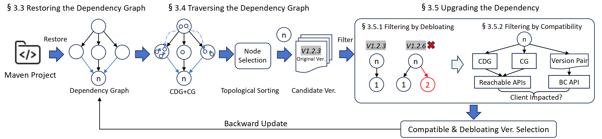
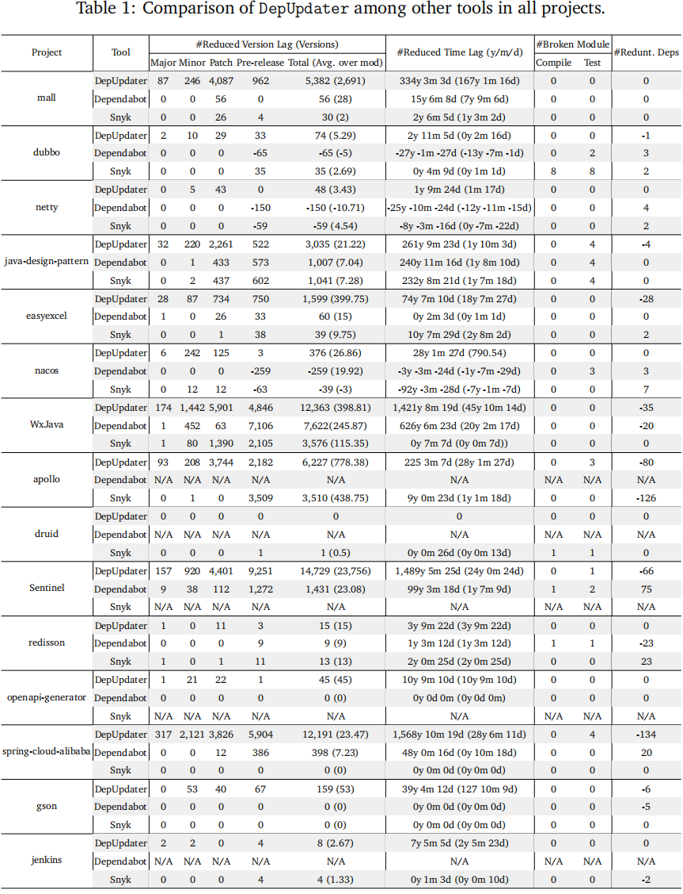

#  Minimizing Breaking Changes and Redundancy in Mitigating Technical Lag for Java Projects
[](https://arxiv.org/abs/25xx.xxxx)  [](https://conf.researchr.org/home/icse-2026)


## Abstract 
Re-using open-source software (OSS) can avoid reinventing the wheel, but failing to keep it up-to-date can lead to missing new features and persisting bugs or vulnerabilities that have already been resolved. The use of outdated OSS introduces technical lag,
necessitating timely upgrades. However, maintaining up-to-date libraries is challenging, as it may introduce compatibility issues that break the project or add redundant dependencies. These issues discourage developers from upgrading libraries, highlighting the
need for a fully automated solution that balances version upgrades, reduces technical lag, ensures compatibility, and prunes redundant dependencies.

To this end, we propose DepUpdater, which ensures that upgrades minimize technical lag as much as possible while avoiding compatibility issues and redundant dependencies. The comparison with existing dependency management tools demonstrates that DepUpdater more effectively reduces technical lag while ensuring compatibility and pruning redundant dependencies. Additionally, an ablation study highlights the potential benefits of considering pruning requirements during upgrades to mitigate compatibility issues. Finally, leveraging DepUpdater, we investigate the impact of transitive dependency upgrades on client compatibility, providing insights for future research.



## Usage

### Requirements

**1.** JDK 17

**2.** Maven 3.9.5

**3.** python 3.10.12

**4.** Ubuntu 2020

**5.** Necessary python packages :

* Install a virtual environment

```shell
python -m venv .venv
```

* Active the virtual environment

```bash
source .venv/bin/activate
```

* Install the required packages

```shell
pip install -r requirements.txt
```

**6.** A MongoDB docker container :

* Download `maven_deps.zip`  from https://anonymfile.com/m1z30/maven-deps.zip, then unzip it to get `maven_deps.bson`. (maven_des.zip is 2.42GB)
* Download `maven.zip` from https://anonymfile.com/68L20/maven.zip , then unzip it to get `maven.bson`.
* Place `maven_deps.bson` and `maven.bson` at the root directory of this repository.
* Activate a MongoDB docker container named `maven_mongodb`.

```shell
docker-compose -f docker-compose.yml up -d
```

* Restore two collections of the MongoDB :

restore the `maven` collection

```shell
docker exec maven_mongodb mongorestore --db maven --collection maven /data/maven.bson
```

retore the `maven_deps` collection

```shell
docker exec maven_mongodb mongorestore --db maven --collection maven_deps /data/maven_deps.bson
```

* Create indexes on the two collections 

Add two compound indexes to the `maven` collection: (`group`, `artifact`) and (`group`, `artifact`, `version`).

Add one compound index to the `maven_deps` collection: `parent`.

**7.** A `Sqlite`  database :

* Download `reusable_data.zip` from https://anonymfile.com/PN8KZ/reusable-data.zip, then unzip it to get `reusable_data.sqlite`.
* Place `reusable_data.sqlite` at the root directory of this repository.


### Run `DepUpdater`

Execute the MainProcess.py:

```
python MainProcess.py -h
usage: MainProcess.py [-h] [-r ROOT] [-m MODULE] [-j JAR] [-l LOCAL_DEP_JAR [LOCAL_DEP_JAR ...]]

options:
  -h, --help            show this help message and exit
  -r ROOT, --root ROOT  the path to the cloned folder
  -m MODULE, --module MODULE
                        the relative path to the module
  -j JAR, --jar JAR     the relative path to the client jar
  -l LOCAL_DEP_JAR [LOCAL_DEP_JAR ...], --local_dep_jar LOCAL_DEP_JAR [LOCAL_DEP_JAR ...]
                        the relative paths to the local module jar depended by client
```

the `ROOT` and `MODULE` parameters are necessary, while `JAR` and `LOCAL_DEP_JAR` parameters are optional.

An example usage:

```shell
python MainProcess.py -r /home/test/mall -m mall-common
```

The `mall` repository is cloned from https://github.com/macrozheng/mall.git, and mall-common is a module of this repository.
`/home/test/mall` is the local location of the cloned repository, and `mall-common` is the relative path of the mall-common module.

## Source code structure

The structure of this repository is as follows:

```
.
├── computation # upgrade a dependency
├── constants.py # constants
├── database # query and update the Mongodb and sqlite
├── docker-compose-mongodb.yml # docker file
├── evaluation # compute reduced tech lag and dep count
├── logger # generate log
├── MainProcess.py # main function
├── maven.bson # maven collection
├── maven_deps.bson # maven_deps collection
├── preprocess # restore the dependency graph
├── README.md
├── requirements.txt # necessary pagckages
├── reusable_data.sqlite # splite file
├── RQs_data # data of RQs
├── traverse # traverse the dependency graph
└── update # update the database as well as the graph
```

## Data for RQs

Data for RQs is in the `RQs_data` folder, the structure of this folder is as follows:

```
.
├── RQ1
│   ├── RQ1_Dependabot.csv # Dependabot in RQ1
│   ├── RQ1_DepUpdater.csv # DepUpdater in RQ1
│   └── RQ1_Snyk.csv # Snyk in RQ1
├── RQ2
│   ├── RQ2_Compatibility_Only.csv # Compatibility only in RQ1
│   ├── RQ2_Pruning_Only.csv # Pruning only in RQ1
│   └── RQ2_Naive.csv # Naive in RQ1
└── RQ3
    ├── RQ3_API_Distribution.csv # Distribution of client-impacting API
    └── RQ3_Client_Distribution.csv # Distribution of Broken-Client
```

## For Major Revision

We appreciate the suggestions in the Metareview and Review A to provide the data at the project level. We applied the data from different tools to each project as follows:



Note: 
1. Because Dependabot and Snyk do not consider pruning during the upgrades, they often introduce redundant dependencies, which can increase overall technical lag. For example, Dependabot increased the total version lag by 150 versions for the Netty project.
2. We have not listed the data for GoblinUpdater above, **as all of its data points are zero**.
3. After upgrades by Dependabot, three projects (Apollo, Jenkins, Druid) were unable to generate a dependency tree. After upgrades by Snyk, two projects (Sentinel, Jenkins) could not generate a dependency tree. Since we compute technical lag based on the dependency tree, we have listed the data for these projects as N/A.


## Pull Requests to Upgrade Dependencies


| Repository                                                   | PR                                                           | Stars | Compilation | Regression Test | Status    | Note |
| ------------------------------------------------------------ | ------------------------------------------------------------ | ----- | --------------------- | --------- | --------- | --------- |
| [easyexcel](https://github.com/alibaba/easyexcel)            | [#4123](https://github.com/alibaba/easyexcel/pull/4123)      | 33.5k |  &#10004;| &#10004; | submitted |  |
| [spring-cloud-alibaba](https://github.com/alibaba/spring-cloud-alibaba) | [#4023](https://github.com/alibaba/spring-cloud-alibaba/pull/4023) | 28.6k | &#10004; | &#10004; | submitted |  |
| [dubbo](https://github.com/apache/dubbo)                     | [#15577](https://github.com/apache/dubbo/pull/15577)                                                       | 41.2k | &#10004; | &#10004; | wont fix | The project maintains the same dependency versions across all modules, which is unrelated to our tool.|
| [Sentinel](https://github.com/alibaba/Sentinel)                                             | [#3536](https://github.com/alibaba/Sentinel/pull/3536)                                                  | 22.8k | &#10004; | &#10004; | submitted |  |
| [WxJava](https://github.com/binarywang/WxJava)                                                       | [#3643](https://github.com/binarywang/WxJava/pull/3643)                                                        | 31.6k | &#10004; | No tests in this module | merged | The maintainer upgraded the dependencies after review our PR. |


Stay informed about our ongoing efforts! 🤖

---


> [!IMPORTANT]
>
> Feel free to share your suggestions for this process by opening issues or PRs. :)


